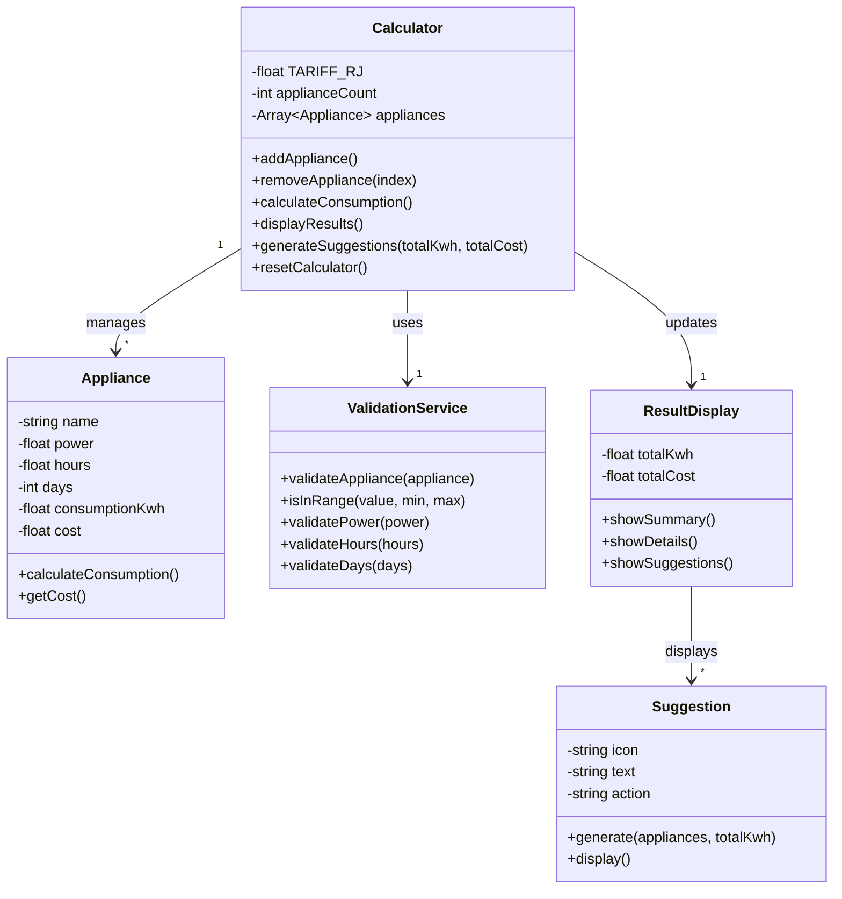
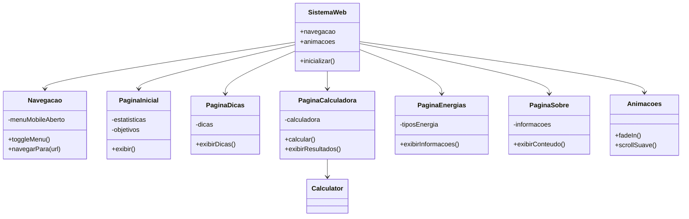

# Diagramas de Classe - Rio Sustentável

## Diagrama 1: Sistema de Calculadora de Consumo

---

## Diagrama 2: Estrutura Geral do Sistema Web

---

## Descrição dos Diagramas

### Diagrama 1 - Sistema de Calculadora de Consumo

Este diagrama representa a estrutura da calculadora de consumo de energia, mostrando:

- **Calculator**: Classe principal que gerencia o cálculo de consumo
- **Appliance**: Representa cada aparelho elétrico com suas características
- **ValidationService**: Serviço para validar os dados inseridos
- **ResultDisplay**: Responsável por exibir os resultados calculados
- **Suggestion**: Gera sugestões personalizadas de economia

### Diagrama 2 - Estrutura Geral do Sistema Web

Este diagrama mostra a arquitetura simplificada do website, incluindo:

- **SistemaWeb**: Classe principal que coordena todo o sistema
- **Navegacao**: Gerencia menu mobile e navegação entre páginas
- **Animacoes**: Controla efeitos visuais (fade-in, scroll suave)
- **5 Páginas**: PaginaInicial, PaginaDicas, PaginaCalculadora, PaginaEnergias, PaginaSobre
- **Integração**: PaginaCalculadora usa a classe Calculator (do Diagrama 1)

### Relacionamentos

Os diagramas mostram os relacionamentos entre as classes:
- **→ (Seta)**: Indica que uma classe usa ou se relaciona com outra
- **Números (1, *)**: Indicam quantos objetos se relacionam
  - `1` = exatamente um
  - `*` = zero ou mais (múltiplos)

**Exemplo**: `Calculator "1" --> "*" Appliance` significa que 1 Calculator gerencia vários (0 ou mais) Appliances.

